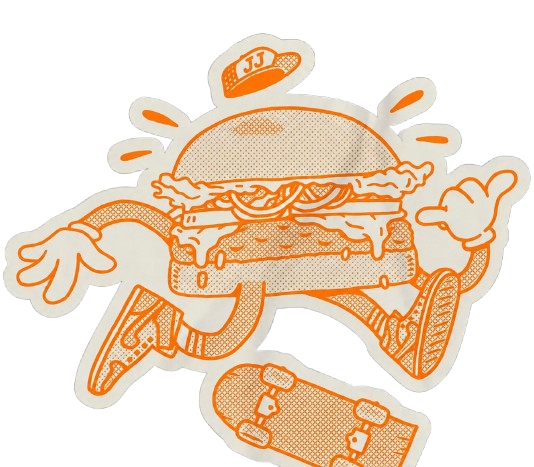
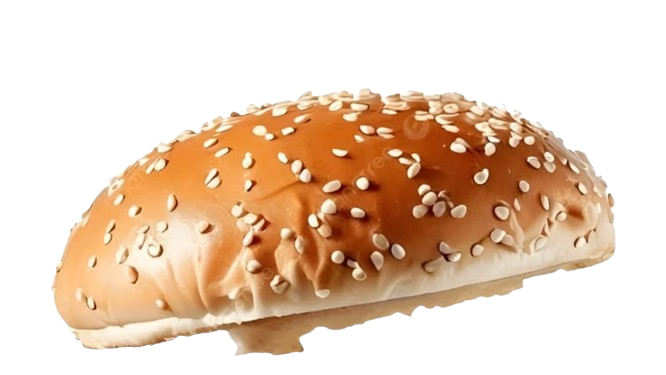
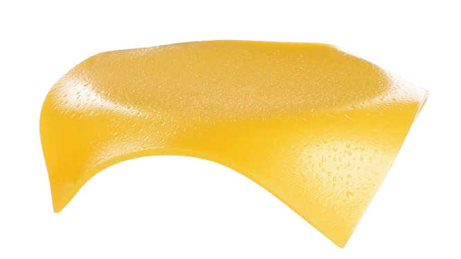
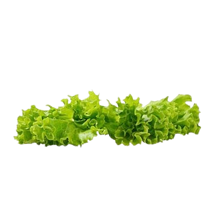
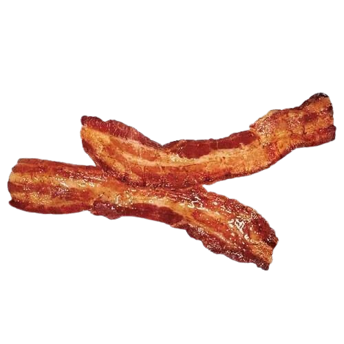
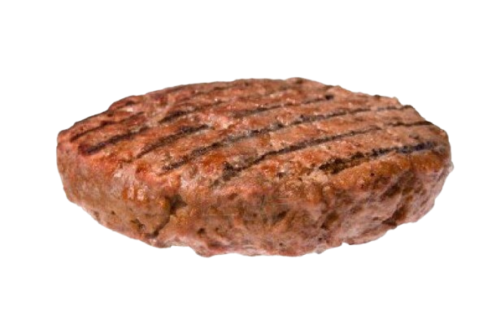
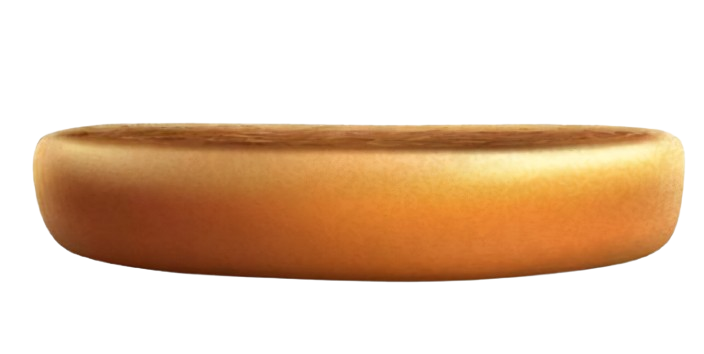

<!DOCTYPE html>
<html lang="pt-BR">
<head>
    <meta charset="UTF-8">
    <meta name="viewport" content="width=device-width, initial-scale=1.0">
    <meta name="color-scheme" content="light only">
    <meta name="theme-color" content="#ffffff">
    <title>Monte seu Hambúrguer Premium</title>
    
    
</head>
<body>

    <main class="construtor-container">
        <h1>Monte seu Hambúrguer</h1>
        

            
            

            

            

            

            

            

            

            
Total: R$ 25,50

        

        

            <button id="btn-pepino" onclick="alternarIngrediente('pepino', 'Pepino', 1.50)">Remover Pepino (R$ 1,50)</button>
            <button id="btn-mussarela" onclick="alternarIngrediente('mussarela', 'Mussarela', 3.00)">Remover Mussarela (R$ 3,00)</button>
            <button id="btn-bacon" onclick="alternarIngrediente('bacon', 'Bacon', 4.00)">Remover Bacon (R$ 4,00)</button>
            <button id="btn-carne" onclick="alternarIngrediente('carne', 'Carne', 6.00)">Remover Carne (R$ 6,00)</button>
            <button id="btn-alface" onclick="alternarIngrediente('alface', 'Alface', 1.00)" style="grid-column: span 2;">Remover Alface (R$ 1,00)</button>
        

        <button class="btn-finalizar" onclick="abrirModal()">FINALIZAR PEDIDO ➔</button>
    </main>

    

        

            <h2>Dados do seu Pedido</h2>
            
<label>Seu Nome:</label><input type="text" id="txt-nome" placeholder="Digite seu nome completo">

            

                <label>Como deseja receber?</label>
                <select id="select-entrega" onchange="mudarOpcaoEntrega()">
                    <option value="Entrega">Delivery (Entrega em Casa)</option>
                    <option value="Retirada">Retirar na Hamburgueria</option>
                </select>
            

            
<label>Endereço de Entrega:</label><input type="text" id="txt-endereco" placeholder="Rua, número e bairro">

            <button class="btn-enviar-whats" onclick="enviarPedidoWhatsApp()">Enviar Pedido no WhatsApp 💬</button>
            <button class="btn-fechar" onclick="fecharModal()">Voltar e Modificar lanche</button>
        

    

    
</body>
</html>
